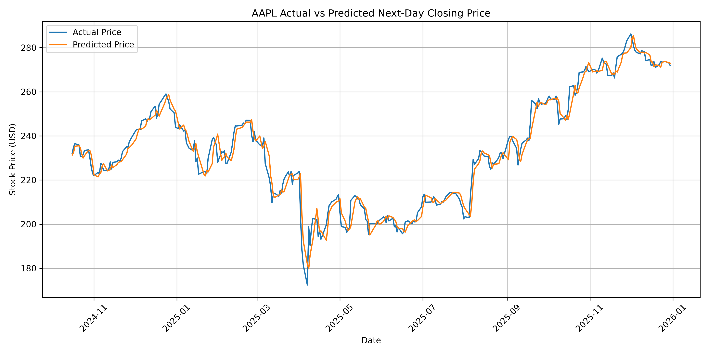

# Stock Price Predictor

A beginner-friendly Machine Learning project that predicts the next trading day's closing price using historical stock market data and Linear Regression.

The program downloads historical stock data using Yahoo Finance, trains a machine learning model, evaluates its performance, and generates a graph comparing actual and predicted prices.

## Features

- Downloads historical stock data automatically
- Accepts different stock ticker symbols
- Uses real historical market data
- Predicts the next trading day's closing price
- Uses Linear Regression
- Uses chronological 80/20 train-test splitting
- Calculates MAE, RMSE, and R²
- Displays sample predictions
- Saves predictions to a CSV file
- Generates an Actual vs Predicted graph
- Handles invalid ticker symbols

## Technologies Used

- Python
- Pandas
- NumPy
- Matplotlib
- Scikit-learn
- yfinance
- Linear Regression

## Machine Learning Workflow

```text
Stock Ticker
     ↓
Yahoo Finance Historical Data
     ↓
Data Preprocessing
     ↓
Create Next-Day Close Target
     ↓
Chronological 80/20 Split
     ↓
Linear Regression
     ↓
Model Training
     ↓
Next-Day Price Prediction
     ↓
Model Evaluation
     ↓
CSV Results + Prediction Graph
```

## Installation

Clone the repository:

```bash
git clone https://github.com/MdArshath17/Stock-Price-Predictor.git
```

Move into the project folder:

```bash
cd Stock-Price-Predictor
```

Install the required libraries:

```bash
pip install -r requirements.txt
```
## Usage

Run the program:

```bash
python stock_predictor.py
```

Enter a stock ticker when prompted:

```text
Enter stock ticker (Example: AAPL, MSFT, GOOGL): AAPL
```

The program downloads the historical data, trains the model, evaluates the predictions, and creates output files.

## Input Features

The model uses:

- Open price
- High price
- Low price
- Closing price
- Trading volume

The target variable is the next trading day's closing price.

## Model Evaluation

The model is evaluated using:

- Mean Absolute Error (MAE)
- Root Mean Squared Error (RMSE)
- R² Score

Example AAPL test results:

```text
MAE  : 3.03
RMSE : 4.30
R²   : 0.9693
```

These values are example results from the historical period used during development and may change when the dataset or time period changes.

R² should not be interpreted as a percentage accuracy score.

## Example Prediction Graph



The graph compares the actual next-day closing prices with the values predicted by the Linear Regression model.

## Output Files

For an AAPL run, the program generates:

```text
AAPL_predictions.csv
AAPL_prediction_graph.png
```

The same naming format is automatically used for other ticker symbols.

## Limitations

Stock prices are influenced by many factors including financial news, company performance, economic conditions, market sentiment, and unexpected events.

This project uses historical OHLCV data and Linear Regression and therefore should not be considered a reliable financial forecasting or trading system.

## Purpose

This project was developed as part of an Artificial Intelligence internship project to practice:

- Data preprocessing
- Machine Learning
- Regression
- Model training and testing
- Model evaluation
- Data visualization
- Working with real-world datasets

## Disclaimer

This project is for educational purposes only and is not financial or investment advice.
